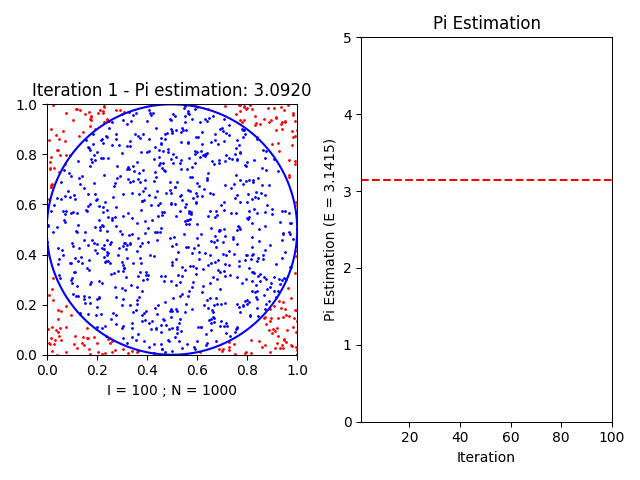
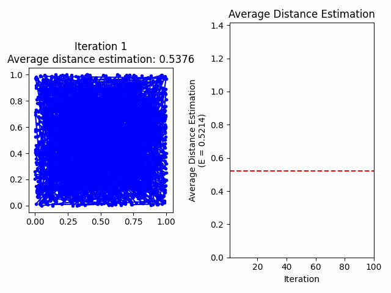

# Python animations

## Monte Carlo Animations

### Pi Estimation

> What is an approximation for pi?

  
Demo with 100 iterations and 1000 points per iteration.

  

[Pi estimation results](resources/monte_carlo/pi/results.txt) by the Law of Large Numbers with 1000 iterations and 1000 points per iteration.

### Two Points Average Distance Estimation

> What is the average distance between two points choosen uniformly and independently at random in the rectangle [A, B] x [C, D]?

  
Demo with 100 iterations and 1000 pair of points per iteration in rectangle [0, 1] x [0, 1].

  

[Two points average distance estimation results](resources/monte_carlo/two_points_average_distance/results.txt) by the Law of Large Numbers with 1000 iterations and 1000 pair of points per iteration in rectangle [0, 1] x [0, 1].