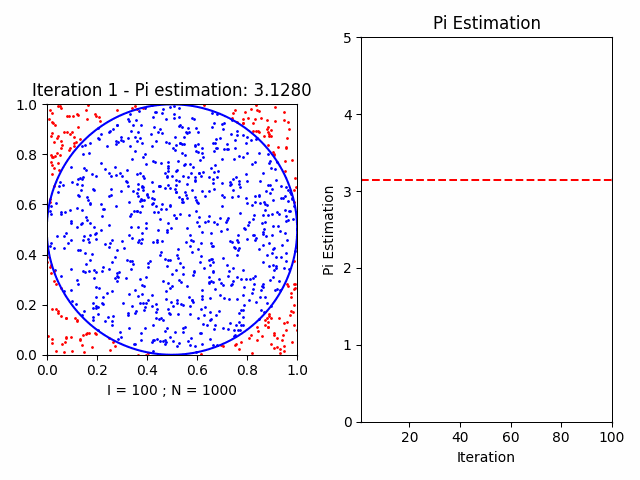

# Python animations

## Monte Carlo Animations

### Pi Estimation

Demo with 100 iterations and 1000 points per iteration.

[Pi estimation results](resources/monte_carlo/pi/demo.txt) by the Law of Large Numbers with 1000 iterations and 1000 points per iteration.